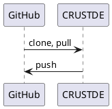
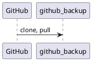
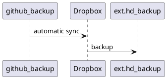
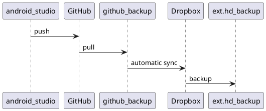

[//]: # (auto_md_to_doc_comments segment start A)

# development_environment

[//]: # (auto_cargo_toml_to_md start)

**Description of my Windows and Linux development environment for Rust**  
***version: 2022.421.1347 date: 2022-05-12 author: [bestia.dev](https://bestia.dev) repository: [GitHub](https://github.com/CRUSTDE-Containerized-Rust-Dev-Env/development_environment)***  

 
 

[//]: # (auto_cargo_toml_to_md end)

**WARNING !!! This is a public repository: never write or save secrets here!!!**

 
 development_environment is a member of the [CRUSTDE-Containerized-Rust-Dev-Env](https://github.com/orgs/CRUSTDE-Containerized-Rust-Dev-Env/repositories?q=sort%3Aname-asc) project.

Hashtags: #rustlang #tutorial #buildtool #developmenttool  
My projects on GitHub are more like a tutorial than a finished product: [bestia-dev tutorials](https://github.com/bestia-dev/tutorials_rust_wasm).

## Win installation 2023

Often we must reinstall Windows from scratch to solve some unsolvable problems.  
Thanks, Microsoft!  
This is a good exercise. We must learn how to save settings for different programs.  

## About my notebook

IdeaPad Flex5 14ARE05  
Processor AMD Ryzen 5 4500U with Radeon Graphics 2.38 GHz  
Installed RAM 16,0 GB (15,4 GB usable)  
System type 64-bit operating system, x64-based processor  

## Windows

Edition Windows 10 Pro  
Version 22H2  
OS build 19045.3570  
Activation: Windows is activated with a digital license linked to your Microsoft account

I split my SSD into partitions `C:` and `D:`. Every time I reinstall Windows I completely format the `C:` partition, but the `D:` partition remains intact.  
I have the Dropbox folder on my `D:` partition. So it will survive the reinstallation of Windows. It is also better for backups to have separate system and data disks.  

## System backup win10

Backup, backup, backup... Do it all the time. Disks can die in an instant and you lose everything.  
It is funny that in Win10, the name of this function is "Backup and Restore (Windows 7)".  
Open the System Backup Image Tool. In Windows 10, head to Control Panel > Backup and Restore (Windows 7) > Create a System Image onto an external disk.  
A system image contains everything: data, programs, OS, config,... from the `C:` drive.  

The `D:` drive contains only data and is much easier to backup/copy. I just copy all the files to an external drive. And I have Dropbox installed to sync this drive to the cloud.  

## Download ISO for Win10

<https://www.microsoft.com/sl-si/software-download/windows10>  
special Media creation tool for download  
download windows.iso to my Ventoy bootable USB storage  
<https://www.ventoy.net/en/index.html>

## Install Win10 from scratch

Turn off the computer. Insert the Ventoy bootable USB storage.  
Turn on the computer and press F2 to enter the boot menu. Choose boot from USB.  
Don't connect to the internet because then you cannot make a local account, but only a Microsoft online account.  
I don't want a Microsoft account. I want to have a local account.  
The computer will restart a couple of times. Pretty fast and easy to install.  
The installation creates a new folder `windows.old` that contains 200GB of files of the old OS.  
Detach the Ventoy bootable USB storage and restart.  

## After installation

After installation is completed login to the machine.  
Connect over wifi to the internet. In my case, it assumes that I am on a metered connection. Go to Wifi Properties and turn the metered connection off.  
The computer will work in the background to download the drivers and updates and install them. That can take a while.  
You can right-click on the Start button and choose "Device Manager" to see what drivers are missing.  
For my computer, I will install the Lenovo software and drivers from:  
<https://pcsupport.lenovo.com/us/en/products/laptops-and-netbooks/flex-series/flex-5-14are05>  
Download Lenovo Vantage. Get from Microsoft store 430 MB.  
Launch Lenovo Vantage. I don't need it to start at boot or other automatic things.  
Then "Check updates" will find updates and I want to install them all. After 15 minutes all is installed. Restart the system.  

## Upgrade to Pro

Right-click on the Start button then choose System. My Windows is edition Home. I want to "upgrade" to Pro. I have the product key.  
Choose "Change product key or upgrade your edition of Windows" and input the product key.  

## Language and region

Left-click on the Language icon on the taskbar and choose Language Preferences.  
Add language - Slovenian - Install language pack, but NOT Set as Windows display language.  
Order of languages: English (United States), English(Slovenia), Slovenian.  
Click on Date, Time and regional formatting - Current format: Slovenia

## Taskbar

On the taskbar right click then "Unlock the taskbar". Right-click on Taskbar and disable: Search box, Task view, News and interest, Windows Ink,...  
I like to have the taskbar on the right and not on the bottom because there is way more space horizontally than vertically on a 19:6 screen. Right-click on Taskbar icons and Hide: Meet now.  
Right-click on Taskbar - Taskbar settings - Turn system icons on and off - I don't need keyboard indicator, Location and microphone.  
The taskbar does not show the day of the week. Unlock the taskbar and widen the taskbar just a bit to show the day of the week. Then lock the taskbar.  

## Start menu

Unpin all the non-usable tiles. Eventually, Pin to start menu interesting shortcuts.  

## Desktop image, icons, dark mode

Search Theme and related settings - Desktop icons settings - Disable the Recycle bin.  
In Theme and related settings - Click on Picture and browse   c\Users\Luciano\AppData\Roaming\Microsoft\Windows\Themes\wallpaper.png  
Copy icons from c\Users\luciano\Desktop to C:\Users\luciano\Desktop  
Search Turn on Dark mode system-wide and Choose your color: Dark.  
Right-click on Desktop and choose Display settings - Multiple displays - Extend this display.  
Right-click taskbar - Taskbar settings - Disable Show taskbar on all displays.  
Right-click on Desktop - View - Large icons.  

## Tweaks

Make file extension visible in Powershell as administrator and then restart win10:  

```powershell
New-ItemProperty -Path "HKCU:\Software\Microsoft\Windows\CurrentVersion\Explorer\Advanced" -Name "HideFileExt" -Value 0 -PropertyType DWORD -Force
```

In Windows Explorer View - Enable Hidden items.  
Press Win+V and enable the Clipboard manager to have more than one item in the clipboard.  
I want to uninstall OneDrive because I use Dropbox. Apps & features - Microsoft One Drive - Uninstall.  
Similarly uninstall Skype, Movies, Sticky Notes, Weather, XBox, Maps, Mail... all apps that I already have and are NOT from Microsoft.  

## Certificates

I have some personal certificates for use with the government. The backup of my keys is in my encrypted vault.  

From the encrypted vault, copy the certificates .p12 files somewhere locally temporarily.  
In Windows type mmc into Start and choose File - Add Remove Snap-in - Certificates - Personal.  
Right-click - All tasks - Import - browse the certificate .p12 file - choose high security ask for the password on every use of the certificate. Don't make the private key exportable.  
Git for Windows comes with `C:\Program Files\Git\usr\bin\shred.exe`. Use it to shred/delete the temporary .p12 files.

## Install Programs on Windows

A bunch of programs must be installed for a usable machine for development.

## TotalCmd

To Install and configure TotalCmd follow the instructions: <https://github.com/CRUSTDE-Containerized-Rust-Dev-Env/total_commander_best_file_manager>  

## Firefox

<https://www.mozilla.org/en-US/firefox/new/>
I use Firefox just for programming purposes because Rust was born at Mozilla.  

## Chrome

<https://www.google.com/chrome/>
I have more Google accounts: private, official, developer, project,...  
Log in to a Google account, the 2FA is on my smartphone. The Chrome extensions are also stored in the account.  
I use Chrome "Profiles" to isolate different Google accounts.  
First login to a specific Google account. Then click the 3 dot menu at the top right of Chrome. Click Settings. Click Customize your Chrome profile. Scroll down and click the Create Desktop shortcut.  
I want to have this shortcut in the Start menu and not on the desktop. Sadly, the "Pin to start" does not work, I don't know why.  
But I can move the `lnk` file from the desktop location `%userprofile%\desktop` to the Start Menu location for the actual user (hidden and system folders):  `%AppData%\Microsoft\Windows\Start Menu\Programs`. Now the shortcut is in the Start menu and I can use Pin to Start to create a tile. That works perfectly.  
FYI: There is also the folder `%ProgramData%\Microsoft\Windows\Start Menu\Programs` that contains Start Menu shortcuts for all users.  

## Libre office

<https://www.libreoffice.org/download/download-libreoffice/>  
345 MB  
I don't like autocomplete. Disable all of that.  

## Whatsapp

It is already prepared in Win10, but it still needs to download the latest version.  
Run it and it shows a QR code. On the smartphone open Whatsapp-Settings - QRCode-Scan code and then Link the device.

## Dropbox

I split my SSD into partitions `C:` and `D:`. Every time I reinstall Windows I completely format the `C:` partition, but the `D:` partition remains intact.  
I have the Dropbox folder on my `D:` partition. So it will survive the reinstallation of Windows. It is also better for backups to have separate system and data disks.

I already had Dropbox on my PC before the reinstall and used "Selective folders". Now I want to install it again, but I don't want to make a mess with my files.  
I will rename d:\Dropbox into d:\Dropbox_old.  
Login to <https://www.dropbox.com/home>. Click on the profile right top and choose "Install Dropbox app" - Download Dropbox app. Run DropboxInstaller.exe.  
The browser should stay open on the user's Dropbox page. After installation, the application will use the browser to log in.  
Choose folders to sync. I already split the folders into sync and non_sync folders. So it is easy to choose all the sync folders.  
Advanced - location D:\Dropbox. Done. Wait a little to start. And then click the taskbar icon - Profile - Quit.  
Now I can rename the D:\Dropbox_old to d:\Dropbox. Start Dropbox. It will index for 10 minutes.  
If there is a conflict Dropbox will create a new file with the name containing the word "conflict".  

## WezTerm

WezTerm is a powerful cross-platform terminal emulator and multiplexer written in Rust.  
I prefer to use it instead of Windows Console, Windows Terminal, Xterm or Terminator.  
I had a problem that using the Windows Clipboard Manager for "multi-item clipboard" it prepends extra ^[[200~. This is called "bracketed paste" and is becoming standard in many terminal applications because it does not run a command if it finds a character for Enter when pasting. It waits for the user to read what is pasted and then presses Enter manually or choose to abort the action. This is very important when copying commands from the internet. On the website, there are many technics to hide visually a text but still copy it to the clipboard. So there we go, no more WYSIWYG. Many administrators always paste text copied from the internet into a simple text editor like Notepad++. That will show all the important characters even the invisible ones if you need. From there you can copy a text that is visually correct without malicious hidden commands.  
<https://cirw.in/blog/bracketed-paste>  
The Clipboard Manager is sending ctrl+v under the hood. That key combination means "the next character will be taken literally". Then shift-ctrl-v pastes the "bracketed paste" that starts with ^[[200~. But unfortunately, the first character is not understood as a special code, but as a normal character "literally".  
Create/edit the configuration .lua file to ignore the ctrl+v key binding.  
In the lua config file is defined that Wezterm opens by default into `WSL:Debian`.  
On start opens 2 windows side-by-side for `WSL:Debian` and git-bash.

The template for `$HOME\.config\wezterm\wezterm.lua` is [here](configuration_files/win_files/c/Users/luciano/.config/wezterm/wezterm.lua).  

## CRUSTDE in detail

The installation of the main programs used for CRUSTDE are described in more detail here:
<https://github.com/CRUSTDE-Containerized-Rust-Dev-Env/win_git_git-bash_ssh_VSCode>
<https://github.com/CRUSTDE-Containerized-Rust-Dev-Env/win10_wsl2_debian11>

## Other programs

- paint.net <https://www.getpaint.net/>
- Notepad++ <https://notepad-plus-plus.org/downloads/>
- Shotcut <https://shotcut.org/>
- IrfanView  
- OBS studio  
- Android Studio  
- Krita  
- Arduino  
- Calibre  
- Audacity  
- Inkspace  
- PhotoFilmStrip  
- qBittorent  
- TeamViewer  
- VLC  

## CRUSTDE - Containerized Rust Development Environment

These days I mostly program with Rust on Linux.  
My primary desktop is Win10. Inside it I have WSL2, which is a Linux Virtual Machine. There I installed Debian 12 Bookworm. And now I can use a Linux container with Podman. 

I use `CRUSTDE - Containerized Rust Development Environment` described here <https://github.com/CRUSTDE-Containerized-Rust-Dev-Env/docker_rust_development>.  
This CRUSTDE container is ephemeral and can be destroyed at any time. The important files inside it must be pushed to GitHub, or else they will be destroyed with the CRUSTDE container.  

[//]: # (auto_plantuml start)
<!-- markdownlint-disable MD033 -->
<details><summary>plantuml code:</summary>
<!-- markdownlint-enable MD033 -->



</details>


[//]: # (auto_plantuml end)

## GitHub backup

GitHub is great, but...  
They can cancel all my files in a second without warning. It happened to Iranian programmers when the USA imposed sanctions. It can happen to anybody anytime for any reason. GitHub is owned by Microsoft, the service is free and they don't have any obligation to the programmer whatsoever. If the service is free, you are not the customer with customer rights, you are the product with no rights whatsoever.  
I want to be sure that GitHub is not the only place where my code is stored. I will prepare a folder on my computer to have backups of all my GitHub projects. I will call the folder `github_backup`.  
Today I manually cloned all my GitHub projects. Later I can `git pull` them and have it as a backup on my notebook disk. This folder is a backup, I will not develop inside this folder.  
I prepared a utility that automates this process: <https://github.com/bestia-dev/github_readme_copy>  

[//]: # (auto_plantuml start)
<!-- markdownlint-disable MD033 -->
<details><summary>plantuml code:</summary>
<!-- markdownlint-enable MD033 -->



</details>


[//]: # (auto_plantuml end)

## Dropbox

I have a 2TB storage on Dropbox for 12€/month. It is not cheap, but I had bad experiences with GoogleDrive and OneDrive in the early days. Maybe they are better now, but I don't want to retry everything. I am a paying customer, so I expect some responsibility from Dropbox. Maybe I am just delusional. They can go bankrupt in a matter of hours with modern financial games.  
I am putting all my eggs in the basket of Dropbox, but eventually, I make backups of all these files. I make backups on 2 external hard drives and I keep them in separate houses. Just for fun.  
I use my app [dropbox_backup_to_external_disk](https://github.com/bestia-dev/dropbox_backup_to_external_disk) to make backups of Dropbox, because Dropbox does not have an app for that. Shame on them.

[//]: # (auto_plantuml start)
<!-- markdownlint-disable MD033 -->
<details><summary>plantuml code:</summary>
<!-- markdownlint-enable MD033 -->



</details>


[//]: # (auto_plantuml end)

## Android Studio

When I want to make an app for Android I have to use Android Studio in Win10. All the files are pushed to GitHub. From there they are automatically synced with github_backup. The complete diagram:

[//]: # (auto_plantuml start)
<!-- markdownlint-disable MD033 -->
<details><summary>plantuml code:</summary>
<!-- markdownlint-enable MD033 -->



</details>


[//]: # (auto_plantuml end)

These are usually small files and having them go up and down the internet 4 times is not a tragedy. Sure, I could save some time, copying them from one folder to the other locally. Then the sync will just index the files and not send them over the internet.  

## websites

My websites are on a Google Linux virtual machine.  
On my local disk, I always prepare the files and folders structure for the websites. Then I synchronize this folder with the directory on the VM.  
It already happened that I deleted my VM on Google and had to set a new one from scratch. I wanted a clean start. So having an identical copy on my local disk is paramount.  
The local folder is synced with Dropbox for backup.  

## confusion with names

Sadly, it is not possible to use consistently the same "name" everywhere, because there are always some limitation what characters are allowed.  
Alphanumerics are allowed everywhere, but dot, hyphen, underscore are not.  
Also uppercase and lowercase can be limited.

Variants of my name:

bestia.dev - domain name and primary, preferred name  
info at bestia.dev - email address is forwarded to info.bestia.dev at gmail.com  
bestiadev  - docker  
bestia-dev - GitHub (bestiadev is NOT available 2024-03, dot and underscore are not allowed)  
info.bestia.dev at gmail.com  (bestia.dev is NOT available 2024-03, but it is not in use?!?)  

## Open-source and free as a beer

My open-source projects are free as a beer (MIT license).  
I just love programming.  
But I need also to drink. If you find my projects and tutorials helpful, please buy me a beer by donating to my [PayPal](https://paypal.me/LucianoBestia).  
You know the price of a beer in your local bar ;-)  
So I can drink a free beer for your health :-)  
[Na zdravje!](https://translate.google.com/?hl=en&sl=sl&tl=en&text=Na%20zdravje&op=translate) [Alla salute!](https://dictionary.cambridge.org/dictionary/italian-english/alla-salute) [Prost!](https://dictionary.cambridge.org/dictionary/german-english/prost) [Nazdravlje!](https://matadornetwork.com/nights/how-to-say-cheers-in-50-languages/) 🍻

[//bestia.dev](https://bestia.dev)  
[//github.com/bestia-dev](https://github.com/bestia-dev)  
[//bestiadev.substack.com](https://bestiadev.substack.com)  
[//youtube.com/@bestia-dev-tutorials](https://youtube.com/@bestia-dev-tutorials)  

[//]: # (auto_md_to_doc_comments segment end A)
