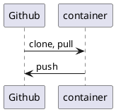
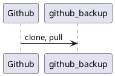
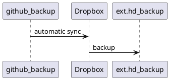
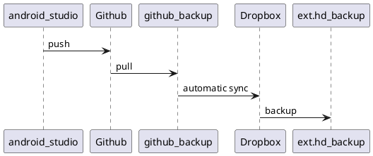

# development_environment

[comment]: # (auto_cargo_toml_to_md start)

**Description of my development environment for Rust**  
***version: 2022.421.1347 date: 2022-05-12 author: [bestia.dev](https://bestia.dev) repository: [Github](https://github.com/bestia-dev/development_environment)***  

[comment]: # (auto_cargo_toml_to_md end)

 


Hashtags: #rustlang #tutorial #buildtool #developmenttool  
My projects on Github are more like a tutorial than a finished product: [bestia-dev tutorials](https://github.com/bestia-dev/tutorials_rust_wasm).

## Rust on Linux

This days I mostly program with Rust on Linux.  
My primary desktop is Win10. Inside it I have WSL2, which is a Linux Virtual Machine. There I installed Debian 11 Bullseye.  
I made a detailed description in <https://github.com/bestia-dev/win10_wsl2_debian11>.

For Rust development for Linux I have the container `rust_dev_vscode_cnt` created from the image `rust_dev_vscode_img` that I described here <https://github.com/bestia-dev/docker_rust_development>.  
This container is ephemeral and can be destroyed any time. The important files inside it must be pushed to Github, else they will be destroyed with the container.  

[comment]: # (auto_plantuml start)




[comment]: # (auto_plantuml end)

## Github

Github is great, but...  
They can cancel all my files in a second without warning. It happened to Iranian programmers when the USA imposed sanctions. It can happen to anybody anytime for any reason. Github is owned by Microsoft, the service is free and they don't have any obligation to the programmer whatsoever. If the service is free, you are not the customer with customer rights, you are the product with no rights whatsoever.  
I want to be sure that Github is not the only place where my code is stored. I will prepare a folder on my computer to have backups of the Github projects. I will call the folder `github_backup`.  
Today I manually cloned all my Github projects. Later I can `git pull` them and have it as a backup on my notebook disk. This folder is a backup, I will not develop inside this folder.  
I prepared a utility that automates this process: <https://github.com/bestia-dev/github_readme_copy>  

[comment]: # (auto_plantuml start)




[comment]: # (auto_plantuml end)

## Dropbox

I have a 2TB storage on Dropbox for 12€/month. It is not cheap, but I had bad experience with GoogleDrive and OneDrive in the early days. Maybe they are better now, but I don't want to retry everything. I am a paying customer, so I expect some responsibility from Dropbox. Maybe I am just delusional. They can go bankrupt in a matter of hours with modern financial games.  
I am putting all my eggs in the basket of Dropbox, but eventually I make backups of all this files. I make backups on 2 external hard drives and I keep them in separate houses. Just for fun.  
I use my app [dropbox_backup_to_external_disk](https://github.com/bestia-dev/dropbox_backup_to_external_disk) to make backups of Dropbox, because Dropbox does not have an app for that. Shame on them.

[comment]: # (auto_plantuml start)




[comment]: # (auto_plantuml end)

## Wezterm 

WezTerm is a powerful cross-platform terminal emulator and multiplexer written in Rust.  
I prefer to use it instead of Windows Console, Windows Terminal, xterm or terminator.  
I had a problem that using the Windows Clipboard Manager for "multi item clipboard" it prepends extra ^[[200~. This is called "bracketed paste" and is becoming standard in many terminal applications, because it does not run a command if it finds a character for Enter when pasting. It waits that the user reads what is pasted and then press Enter manually or choose to abort the action. This is very important when copying commands from the internet. On the website there are many technics to hide visually a text, but still copy it to the clipboard. So there we go, no more WYSIWYG. Many administrators always paste text copied from the internet into a simple text editor like Notepad++. That will show all the important characters even the invisible ones if you need. From there you can copy a text that is visually correct without malicious hidden commands.  
<https://cirw.in/blog/bracketed-paste>  
The Clipboard Manager is sending ctrl+v under the hood. That key combination means "the next character will be taken literally". Then shift-ctrl-v pastes the "bracketed paste" that starts with ^[[200~. But unfortunately the first character is not understood as a special code, but as a normal character "literally".
I added to my "%USERPROFILE%\.config\wezterm\wezterm.lua" configuration file to ignore the ctrl+v key binding:

```lua
-- Pull in the wezterm API
local wezterm = require 'wezterm'

-- This table will hold the configuration.
local config = {}

-- In newer versions of wezterm, use the config_builder which will
-- help provide clearer error messages
if wezterm.config_builder then
  config = wezterm.config_builder()
end

-- This is where you actually apply your config choices

-- Luc: I want  to open the Debian bash terminal as default
config.default_domain = 'WSL:Debian'

config.keys = {
    -- Luc: Turn off the default ctrl+v "input the next character literally",
    -- because it works badly with the Windows Cliboard Manager Win+v.
    { key = 'v', mods = 'CTRL', action = wezterm.action.Nop },
}

-- and finally, return the configuration to wezterm
return config
```

In the lua config file is defined that wezterm opens by default into WSL:Debian.  

## Android studio

When I want to make an app for android I have to use Android Studio in Win10. All the files are pushed to Github. And from there they are automatically synced with github_backup. The complete diagram: 

[comment]: # (auto_plantuml start)




[comment]: # (auto_plantuml end)

These are usually small files and having them go up and down the internet 4 times is not a tragedy. Sure, I could save some time, copying them from one folder to the other locally. Then the sync will just index the files and not send them over the internet.  

## Rust on Windows

I don't want to install rust on my windows machine.
I will cross compile for Windows inside the Linux container.

## websites

My websites are on a google Linux virtual machine.
On my local disk I always prepare the files and folders structure for the websites. Then I synchronize this folder with the directory on the VM.
It already happened that I deleted my VM on google and had to set a new one from scratch. I wanted a clean start. So having an identical copy on my local disk is paramount.  
The local folder is synced with Dropbox.  

## confusion with names

Sadly, it is not possible to use consistently the same "name" everywhere, because there are always some limitation what characters are allowed.
Alphanumerics are allowed everywhere, but dot, hyphen, underscore are not.
Also uppercase and lowercase can be limited.

Variants of the name:

bestia.dev - domain name and primary, preferred name  
info at bestia.dev - is forwarded to dev.bestia at gmail.com  
bestiadev  - docker  
bestia-dev - gitub (bestiadev is NOT available 2022-03)  
dev.bestia at gmail.com  (bestia.dev is NOT available 2022-03, but it is not in use?)  

## LF or CRLF

Linux uses end-of-line (eol) LF, but windows uses CRLF. It can be super confusing, because some tools even make auto-correction and magically transforms them.  
I want to have LF everywhere. It makes sense.  
In VSCode I changed the setting `files.eol` to LF. So, this is fixed for new files.  
In windows I fixed `git` to always use LF:

```bash
# globally
 git config --global core.eol lf
 git config --global core.autocrlf input
 ```

in every project separately I have to repair if there are CRLF somewhere:

```bash
 git rm --cached -r . 
 git reset --hard
 
 copy ..\dos2unix.exe .
 for /R %G in (*.txt) do dos2unix "%G"
 for /R %G in (*.md) do dos2unix "%G"
 for /R %G in (*.rs) do dos2unix "%G"
 for /R %G in (*.toml) do dos2unix "%G"
 for /R %G in (*.html) do dos2unix "%G"
 for /R %G in (*.css) do dos2unix "%G"
 for /R %G in (*.js) do dos2unix "%G"
 for /R %G in (*.svg) do dos2unix "%G"
 for /R %G in (*.json) do dos2unix "%G"
 for /R %G in (*.yml) do dos2unix "%G"
 for /R %G in (LICENSE) do dos2unix "%G"
 for /R %G in (.gitignore) do dos2unix "%G"
 del dos2unix.exe
 ```

## Linux shutdown

Now I mostly use to dual-boot into Debian Linux. And there I use Podman to develope in Rust inside a container. Compiling is much faster than inside the WSL. Probably because of file acces. I suppose there are hundreds of small files and that is the major speed difference.  
The standard Linux shutdown is very slow because of Podman. So I created a small bash script `~/shut.sh`:  

```bash
#!/bin/sh
echo 'podman pod stop --all'
podman pod stop --all
echo 'podman stop --all'
podman stop --all
echo 'shutdown -h now'
/usr/sbin/shutdown -h now
```

But the command `shutdown` needs root privileges. I used `sudo chmod +s /usr/sbin/shutdown` to allow me as a normal user to shutdown.  
Now I write `shut` in the terminal to shutdown the computer faster.  

## open-source and free as a beer

My open-source projects are free as a beer (MIT license).  
I just love programming.  
But I need also to drink. If you find my projects and tutorials helpful, please buy me a beer by donating to my [PayPal](https://paypal.me/LucianoBestia).  
You know the price of a beer in your local bar ;-)  
So I can drink a free beer for your health :-)  
[Na zdravje!](https://translate.google.com/?hl=en&sl=sl&tl=en&text=Na%20zdravje&op=translate) [Alla salute!](https://dictionary.cambridge.org/dictionary/italian-english/alla-salute) [Prost!](https://dictionary.cambridge.org/dictionary/german-english/prost) [Nazdravlje!](https://matadornetwork.com/nights/how-to-say-cheers-in-50-languages/) 🍻

[//bestia.dev](https://bestia.dev)  
[//github.com/bestia-dev](https://github.com/bestia-dev)  
[//bestiadev.substack.com](https://bestiadev.substack.com)  
[//youtube.com/@bestia-dev-tutorials](https://youtube.com/@bestia-dev-tutorials)  
