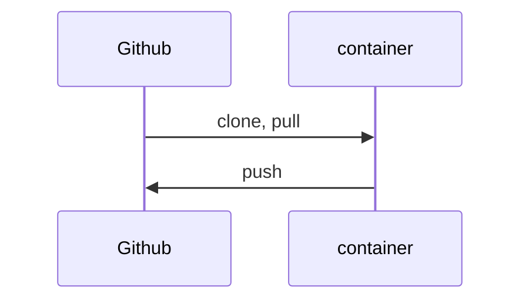
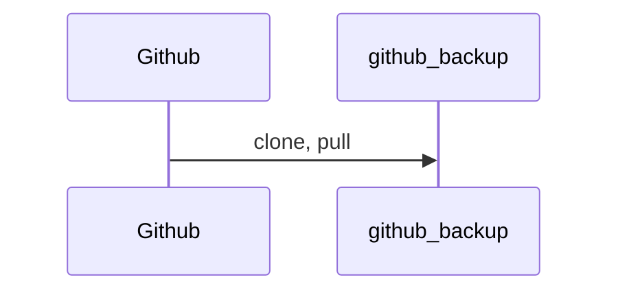
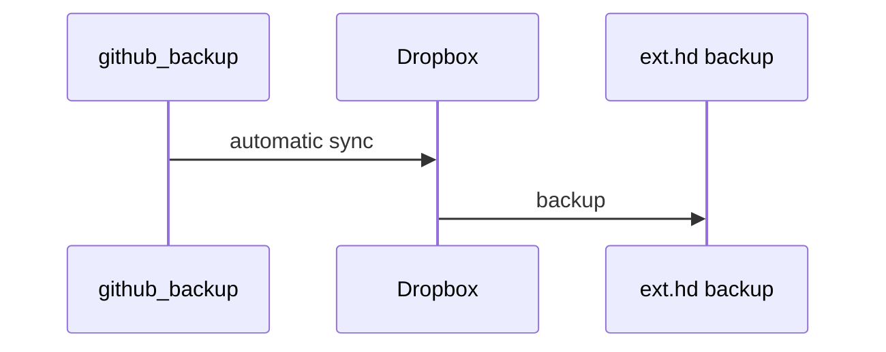
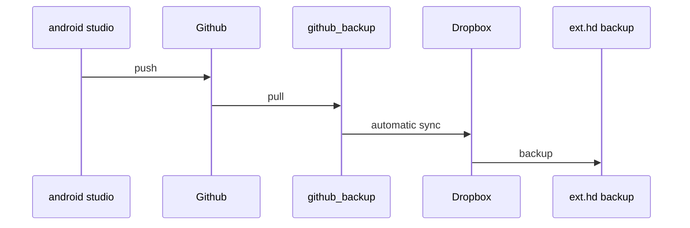

# development_environment

**Description of my development environment for Rust**  
***version: 1.0  date: 2022-03-28 author: [bestia.dev](https://bestia.dev) repository: [GitHub](https://github.com/bestia-dev/development_environment)***  

[](https://hits.seeyoufarm.com)

Hashtags: #rustlang #tutorial #buildtool #developmenttool

## Rust on Linux

This days I mostly program with Rust on Linux.  
My primary desktop is Win10. Inside it I have WSL2, which is a Linux Virtual Machine. There I installed Debian 11 Bullseye.  
I made a detailed description in <https://github.com/bestia-dev/win10_wsl2_debian11>.

For Rust development for Linux I have the container `rust_dev_vscode_cnt` created from the image `rust_dev_vscode_img` that I described here <https://github.com/bestia-dev/docker_rust_development>.  
This container is ephemeral and can be destroyed any time. The important files inside it must be pushed to Github, else they will be destroyed with the container.  



## Github

Github is great, but...  
They can cancel all my files in a second without warning. It happened to Iranian programmers when the USA imposed sanctions. It can happen to anybody anytime for any reason. Github is owned by Microsoft, the service is free and they don't have any obligation to the programmer whatsoever. If the service is free, you are not the customer with customer rights, you are the product with no rights whatsoever.  
I want to be sure that Github is not the only place where my code is stored. I will prepare a folder on my computer to have backups of the Github projects. I will call the folder `github_backup`.  
Today I manually cloned all my Github projects. Later I can `git pull` them and have it as a backup on my notebook disk. This folder is a backup, I will not develop inside this folder.  
TODO: prepare a utility that automates this process.  



## Dropbox

I have a 2TB storage on Dropbox for 12€/month. It is not cheap, but I had bad experience with GoogleDrive and OneDrive in the early days. Maybe they are better now, but I don't want to retry everything. I am a paying customer, so I expect some responsibility from Dropbox. Maybe I am just delusional. They can go bankrupt in a matter of hours with modern financial games.  
I am putting all my eggs in the basket of Dropbox, but eventually I make backups of all this files. I make backups on 2 external hard drives and I keep them in separate houses. Just for fun.  
I use my app [dropbox_backup_to_external_disk](https://github.com/bestia-dev/dropbox_backup_to_external_disk) to make backups of Dropbox, because Dropbox does not have an app for that. Shame on them.



## Android studio

When I want to make an app for android I have to use Android Studio in Win10. All the files are pushed to Github. And from there they are automatically synced with github_backup. The complete diagram: 



These are usually small files and having them go up and down the internet 4 times is not a tragedy. Sure, I could save some time, copying them from one folder to the other locally. Then the sync will just index the files and not send them over the internet.  

## Rust on Windows

I don't want to install rust on my windows machine.
Maybe use a cross compile inside the Linux container?

## websites

My websites are on a google Linux virtual machine.
On my local disk I always prepare the files and folders structure for the websites. Then I synchronize this folder with the directory on the VM.
The local folder is synced with Dropbox. Just for some websites I use Github.  

## confusion with names

Sadly, it is not possible to use consistently the same "name" everywhere, because there are always some limitation what characters are allowed.
Alphanumerics are allowed everywhere, but dot, hyphen, underscore are not.
Also uppercase and lowercase can be limited.

Variants of the name:

bestia.dev - domain name and primary, preferred name  
info at bestia.dev - is forwarded to dev.bestia@gmail.com  
bestiadev  - docker  
bestia-dev - gitub (bestiadev is NOT available 2022-03)  
dev.bestia at gmail.com  (bestia.dev is NOT available 2022-03, but it is not in use?)  

## LF or CRLF

Linux uses end-of-line (eol) LF, but windows uses CRLF. It can be super confusing, because some tools even make auto-correction and magically transforms them.  
I want to have LF everywhere. It makes sense.  
In VSCode I changed the setting `files.eol` to LF. So, this is fixed for new files.  
In windows I fixed `git` to always use LF:

```bash
# globally
 git config --global core.eol lf
 git config --global core.autocrlf input
 ```

in every project separately I have to repair if there are CRLF somewhere:

```bash
 git rm --cached -r . 
 git reset --hard
 
 copy ..\dos2unix.exe .
 for /R %G in (*.txt) do dos2unix "%G"
 for /R %G in (*.md) do dos2unix "%G"
 for /R %G in (*.rs) do dos2unix "%G"
 for /R %G in (*.toml) do dos2unix "%G"
 for /R %G in (*.html) do dos2unix "%G"
 for /R %G in (*.css) do dos2unix "%G"
 for /R %G in (*.js) do dos2unix "%G"
 for /R %G in (*.svg) do dos2unix "%G"
 for /R %G in (*.json) do dos2unix "%G"
 for /R %G in (*.yml) do dos2unix "%G"
 for /R %G in (LICENSE) do dos2unix "%G"
 for /R %G in (.gitignore) do dos2unix "%G"
 del dos2unix.exe
 ```

## open-source and free as a beer

My open-source projects are free as a beer (MIT license).  
I just love programming.  
But I need also to drink. If you find my projects and tutorials helpful,  
please buy me a beer donating on my [paypal](https://paypal.me/LucianoBestia).  
You know the price of a beer in your local bar ;-)  
So I can drink a free beer for your health :-)  
[Na zdravje!](https://translate.google.com/?hl=en&sl=sl&tl=en&text=Na%20zdravje&op=translate) [Alla salute!](https://dictionary.cambridge.org/dictionary/italian-english/alla-salute) [Prost!](https://dictionary.cambridge.org/dictionary/german-english/prost) [Nazdravlje!](https://matadornetwork.com/nights/how-to-say-cheers-in-50-languages/) 🍻
