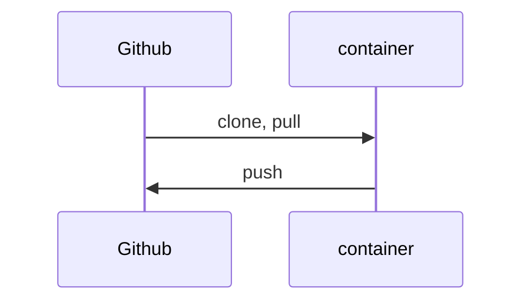
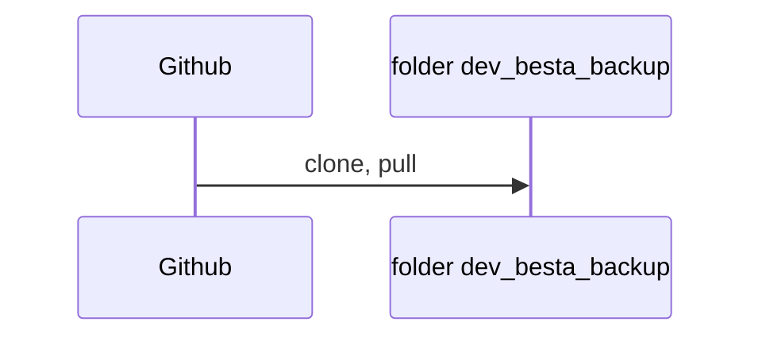
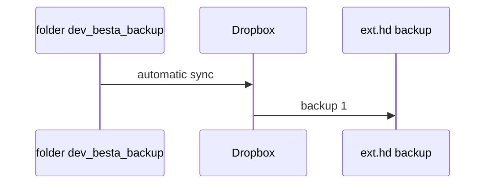

# development_environment

**Description of my development environment for Rust**  
***version: 1.0  date: 2022-03-28 author: [dev_Bestia](https://bestia.dev) repository: [GitHub](https://github.com/LucianoBestia/development_environment)***  

## Rust on Linux

This days I mostly program with Rust on Linux.  
My primary desktop is Win10. Inside it I have WSL2, which is a Linux Virtual Machine. There I installed Debian 11 Bullseye.  
I made a detailed description in <https://github.com/LucianoBestia/win10_wsl2_debian11>.

For Rust development for Linux I have the container `rust_dev_cnt` created from the image `rust_dev_vscode_img` that I described here <https://github.com/LucianoBestia/docker_rust_development>.  
This container is ephemeral and can be destroyed any time. The important files inside it must be pushed to Github, else they will be destroyed with the container.  

## Github

Github is great, but...  
They can cancel all my files in a second without warning. It happened to Iranian programmers when the USA imposed sanctions. It can happen to anybody antime for any reason. Github is owned by Microsoft, the service is free and they don't have any obligation to the programmer whatsoever. If the service is free, you are not the customer with customer rights, you are the product with no rights.  
I want to be sure that Github is not the only place where my code is stored. I will prepare a folder on my computer to have backups of the Github projects. I will call the folder `dev_Bestia_backup`.  
Today I manually cloned all my Github projects. Later I can `git pull` them and have it as a backup on my notebook disk. This folder is a backup, I will not develop inside this folder.  
TODO: prepare a utility that automates this process.  

## Dropbox

I have a 2TB storage on Dropbox for 12€/month. It is not cheap, but I had bad experience with GoogleDrive and OneDrive in the early days. Maybe they are better now, but I don't want to retry everything. I am a paying customer, so I expect some responsability from Dropbox. Maybe I am just delusional. They can go bankrupt in a metter of hours with modern financial games.  
I am putting all my eggs in the basket of Dropbox, but here and there I make backups of everything. I make backups on 2 external hard drives and I keep them in separate houses. Just for fun.  
I use my app [dropbox_backup_to_external_disk](https://github.com/LucianoBestia/dropbox_backup_to_external_disk) to make backups of Dropbox, because Dropbox does not have an app for that. Shame on them.

## Android studio

When I want to make an app for android I have to use Android Studio in Win10. All the files are pushed to Github. The folder is automatically synced with Dropbox.  

## Rust on Windows

I don't know how to containerize the rust development on Windows.

## websites

My websites are on a google Linux virtual machine.
On my local disk I always prepare the files and folders structure for the websites. Then I synchronize this folder with the directory on the VM.
The local folder is synced with Dropbox.

## open-source and free as a beer

My open-source projects are free as a beer (MIT license).  
I just love programming.  
But I need also to drink. If you find my projects and tutorials helpful,  
please buy me a beer donating on my [paypal](https://www.paypal.com/paypalme/LucianoBestia).  
You know the price of a beer in your local bar ;-)  
So I can drink a free beer for your health :-)  
[Na zdravje!](https://translate.google.com/?hl=en&sl=sl&tl=en&text=Na%20zdravje&op=translate) [Alla salute!](https://dictionary.cambridge.org/dictionary/italian-english/alla-salute) [Prost!](https://dictionary.cambridge.org/dictionary/german-english/prost) [Nazdravlje!](https://matadornetwork.com/nights/how-to-say-cheers-in-50-languages/) 🍻
