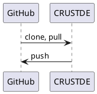
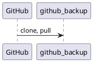
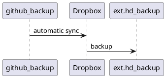
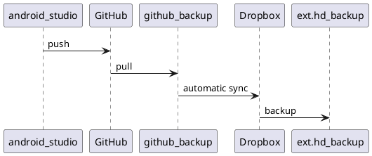

[//]: # (auto_md_to_doc_comments segment start A)

# development_environment

[//]: # (auto_cargo_toml_to_md start)

**Description of my Windows and Linux development environment for Rust**  
***version: 2022.421.1347 date: 2022-05-12 author: [bestia.dev](https://bestia.dev) repository: [GitHub](https://github.com/CRUSTDE-Containerized-Rust-Dev-Env/development_environment)***  

 
 

[//]: # (auto_cargo_toml_to_md end)

**WARNING !!! This is a public repository: never write or save secrets here!!!**

 
 development_environment is a member of the [CRUSTDE-Containerized-Rust-Dev-Env](https://github.com/orgs/CRUSTDE-Containerized-Rust-Dev-Env/repositories?q=sort%3Aname-asc) project.

Hashtags: #rustlang #tutorial #buildtool #developmenttool  
My projects on GitHub are more like a tutorial than a finished product: [bestia-dev tutorials](https://github.com/bestia-dev/tutorials_rust_wasm).

## Win installation

Windows installation with all the usual programs is described in detail in [win_installation.md](win_instalation.md).  

## WSL Debian

To Install Debian Linux inside Windows WSL2 follow the instructions: <https://github.com/CRUSTDE-Containerized-Rust-Dev-Env/win10_wsl2_debian11>  

## CRUSTDE - Containerized Rust Development Environment

These days I mostly program with Rust on Linux.  
My primary desktop is Win10. Inside it I have WSL2, which is a Linux Virtual Machine. There I installed Debian 12 Bookworm. And now I can use a Linux container with Podman. 

I use `CRUSTDE - Containerized Rust Development Environment` described here <https://github.com/CRUSTDE-Containerized-Rust-Dev-Env/docker_rust_development>.  
This CRUSTDE container is ephemeral and can be destroyed at any time. The important files inside it must be pushed to GitHub, or else they will be destroyed with the CRUSTDE container.  

[//]: # (auto_plantuml start)
<!-- markdownlint-disable MD033 -->
<details><summary>plantuml code:</summary>
<!-- markdownlint-enable MD033 -->



</details>


[//]: # (auto_plantuml end)

## GitHub backup

GitHub is great, but...  
They can cancel all my files in a second without warning. It happened to Iranian programmers when the USA imposed sanctions. It can happen to anybody anytime for any reason. GitHub is owned by Microsoft, the service is free and they don't have any obligation to the programmer whatsoever. If the service is free, you are not the customer with customer rights, you are the product with no rights whatsoever.  
I want to be sure that GitHub is not the only place where my code is stored. I will prepare a folder on my computer to have backups of all my GitHub projects. I will call the folder `github_backup`.  
Today I manually cloned all my GitHub projects. Later I can `git pull` them and have it as a backup on my notebook disk. This folder is a backup, I will not develop inside this folder.  
I prepared a utility that automates this process: <https://github.com/bestia-dev/github_readme_copy>  

[//]: # (auto_plantuml start)
<!-- markdownlint-disable MD033 -->
<details><summary>plantuml code:</summary>
<!-- markdownlint-enable MD033 -->



</details>


[//]: # (auto_plantuml end)

## Dropbox

I have a 2TB storage on Dropbox for 12€/month. It is not cheap, but I had bad experiences with GoogleDrive and OneDrive in the early days. Maybe they are better now, but I don't want to retry everything. I am a paying customer, so I expect some responsibility from Dropbox. Maybe I am just delusional. They can go bankrupt in a matter of hours with modern financial games.  
I am putting all my eggs in the basket of Dropbox, but eventually, I make backups of all these files. I make backups on 2 external hard drives and I keep them in separate houses. Just for fun.  
I use my app [dropbox_backup_to_external_disk](https://github.com/bestia-dev/dropbox_backup_to_external_disk) to make backups of Dropbox, because Dropbox does not have an app for that. Shame on them.

[//]: # (auto_plantuml start)
<!-- markdownlint-disable MD033 -->
<details><summary>plantuml code:</summary>
<!-- markdownlint-enable MD033 -->



</details>


[//]: # (auto_plantuml end)

## Android studio

When I want to make an app for android I have to use Android Studio in Win10. All the files are pushed to GitHub. And from there they are automatically synced with github_backup. The complete diagram:

[//]: # (auto_plantuml start)
<!-- markdownlint-disable MD033 -->
<details><summary>plantuml code:</summary>
<!-- markdownlint-enable MD033 -->



</details>


[//]: # (auto_plantuml end)

These are usually small files and having them go up and down the internet 4 times is not a tragedy. Sure, I could save some time, copying them from one folder to the other locally. Then the sync will just index the files and not send them over the internet.  

## Rust on Windows

I don't want to install rust on my windows machine.  
I will try to use a cross compile inside the CRUSTDE container.  

## websites

My websites are on a google Linux virtual machine.  
On my local disk I always prepare the files and folders structure for the websites. Then I synchronize this folder with the directory on the VM.  
It already happened that I deleted my VM on google and had to set a new one from scratch. I wanted a clean start. So having an identical copy on my local disk is paramount.  
The local folder is synced with Dropbox for backup.  

## confusion with names

Sadly, it is not possible to use consistently the same "name" everywhere, because there are always some limitation what characters are allowed.  
Alphanumerics are allowed everywhere, but dot, hyphen, underscore are not.  
Also uppercase and lowercase can be limited.

Variants of my name:

bestia.dev - domain name and primary, preferred name  
info at bestia.dev - email address is forwarded to info.bestia.dev at gmail.com  
bestiadev  - docker  
bestia-dev - GitHub (bestiadev is NOT available 2024-03, dot and underscore are not allowed)  
info.bestia.dev at gmail.com  (bestia.dev is NOT available 2024-03, but it is not in use?!?)  

## LF or CRLF

Linux uses end-of-line (eol) LF, but Windows uses CRLF. It can be super confusing because some tools even make auto-correction and magically transforms them.  
I want to have LF everywhere. It makes sense.  
In VSCode I changed the setting `files.eol` to LF. So, this is fixed for new files.  
In Windows I fixed `git` to always use LF:

```bash
# globally
 git config --global core.eol lf
 git config --global core.autocrlf input
 ```

Just once, in every project separately I used dos2unix to repair if there were CRLF:

```bash
 git rm --cached -r . 
 git reset --hard
 
 copy ..\dos2unix.exe .  
 for /R %G in (*.txt) do dos2unix "%G"
 for /R %G in (*.md) do dos2unix "%G"
 for /R %G in (*.rs) do dos2unix "%G"
 for /R %G in (*.toml) do dos2unix "%G"
 for /R %G in (*.html) do dos2unix "%G"
 for /R %G in (*.css) do dos2unix "%G"
 for /R %G in (*.js) do dos2unix "%G"
 for /R %G in (*.svg) do dos2unix "%G"
 for /R %G in (*.json) do dos2unix "%G"
 for /R %G in (*.yml) do dos2unix "%G"
 for /R %G in (LICENSE) do dos2unix "%G"
 for /R %G in (.gitignore) do dos2unix "%G"
 del dos2unix.exe
 ```

Nowadays I put this file `.gitattributes` in every project:

```conf
# Specific git config for the project

# Declare files that will always have LF line endings on checkout.
*.rs text eol=lf
*.toml text eol=lf
*.md text eol=lf
*.json text eol=lf
*.json5 text eol=lf
*.lock text eol=lf
*.yml text eol=lf
*.html text eol=lf
*.js text eol=lf
*.css text eol=lf
LICENSE text eol=lf
.gitignore text eol=lf
.gitattributes text eol=lf
```

## Linux shutdown (on bare metal)

For some time I used to dual-boot into Debian Linux. And there I use Podman to develop in Rust inside a CRUSTDE container. Compiling was much faster than inside the WSL. Probably because of file access. I suppose there are hundreds of small files and that is the major speed difference.  
I think the performance of WSL is better now. So I decided to use Debian in WSL2 on Win10 again.  
The standard Linux shutdown was very slow because of Podman. So I created a small bash script `~/shut.sh`:  

```bash
#!/bin/sh
echo 'podman pod stop --all'
podman pod stop --all
echo 'podman stop --all'
podman stop --all
echo 'shutdown -h now'
/usr/sbin/shutdown -h now
```

But the command `shutdown` needs root privileges. I used `sudo chmod +s /usr/sbin/shutdown` to allow me as a normal user to shutdown.  
Now I write `shut` in the terminal to shutdown the computer faster.  

## Open-source and free as a beer

My open-source projects are free as a beer (MIT license).  
I just love programming.  
But I need also to drink. If you find my projects and tutorials helpful, please buy me a beer by donating to my [PayPal](https://paypal.me/LucianoBestia).  
You know the price of a beer in your local bar ;-)  
So I can drink a free beer for your health :-)  
[Na zdravje!](https://translate.google.com/?hl=en&sl=sl&tl=en&text=Na%20zdravje&op=translate) [Alla salute!](https://dictionary.cambridge.org/dictionary/italian-english/alla-salute) [Prost!](https://dictionary.cambridge.org/dictionary/german-english/prost) [Nazdravlje!](https://matadornetwork.com/nights/how-to-say-cheers-in-50-languages/) 🍻

[//bestia.dev](https://bestia.dev)  
[//github.com/bestia-dev](https://github.com/bestia-dev)  
[//bestiadev.substack.com](https://bestiadev.substack.com)  
[//youtube.com/@bestia-dev-tutorials](https://youtube.com/@bestia-dev-tutorials)  

[//]: # (auto_md_to_doc_comments segment end A)
